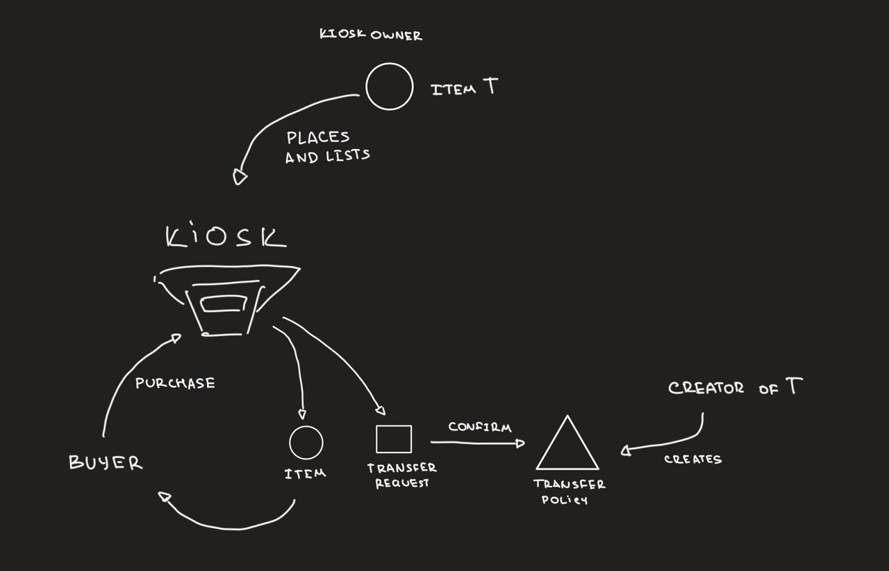

### Overview

(1) Kiosk is a simple module which defines the `Kiosk` type - a basic primitive for listing and buying assets on chain; on every purchase item is released together with a `TransferRequest` - special object which must be resolved at the corresponding `TransferPolicy`.

(2) Kiosk and TransferPolicy are two modules in the Sui Framework which create a simple yet flexible and powerful ecosystem for on-chain trading. TransferPolicy allows creators to set rules applied to every trade made in the Kiosk, while the Kiosk itself has one default feature - "list" - with a matching action "purchase".

### Mechanics: TransferPolicy

For a type to become tradable in Kiosks, a **TransferPolicy** is required. Each TransferPolicy object corresponds to a single type and allows per-type customization of "rules" - custom logic enforced on every trade. Creators can create a TransferPolicy once, share it and then eventually update by adding or removing rules.

### Mechanics: Kiosk

Any object with an existing and accessible **TransferPolicy** can be placed into a **Kiosk** and publicly (or privately) listed for the specified amount of SUI. Once an item is purchased via the `kiosk::purchase` call, it is released together with a **TransferRequest** - a hot potato which must be confirmed by the matching **TransferPolicy** for the transaction to succeed.

### Glossary

- **TransferPolicy** - an object (usually shared) which is required to confirm the **TransferRequest** (and for a type to be tradable in **Kiosks**). Policy can have any number of custom **Rules** - all of them must be followed prior to the request confirmation.
- **Rule** - a module with a function to add a custom rule to the **TransferPolicy** and a way to get a receipt for completing the action. Rule can imply payments (eg Royalty) which are added to **TranferPolicy**'s balance.
- **TransferRequest** - a hot potato object that is issued on `kiosk::purchase` call. It must collect receipts from all required **Rules** to be confirmed by the **TransferPolicy**.
- **Kiosk** - an object (usually shared) which allows `place`-ing and `list`-ing items as well as `purchase`-ing them with a **TransferRequest** issued on a purchase.
- **KioskOwnerCap** - a capability object granting the owner access to `place`, `take`, `list` and other functions of the **Kiosk**.
- **TransferPolicyCap** - a capability object granting the owner permission to _add_ and _remove_ rules to/from the **TransferPolicy** as well as to *withdraw* profits.

---
---
---

Kiosk is a module in the Sui Framework which defines the `Kiosk` type - an object that is used to trade assets on Sui.

Kiosk can be created by anyone by calling the `kiosk::new(): (Kiosk, KioskOwnerCap)` method. The storage for the Kiosk can be defined by the creator, but it is intended to be used as a shared object.

Any item can be placed into a Kiosk by using `kiosk::place`, and then taken with `kiosk::take` function (\*unless it is "locked"). Once placed, an item can be traded if there's an existing and available `TransferPolicy` for this item.

---
By default, a type is not tradable in kiosks and requires a `TransferPolicy<T>` - an object that is used to authorize transfers for the type `T`. Creators can create a new transfer policy via the `transfer_policy::new<T>(Publisher): (TransferPolicy<T>, TransferPolicyCap)` call.

Structure:

- Overview - kiosk and transfer policy
- Architecture
- For users
- For creators
- For marketplaces

Pros:

- trading inventory at hand - besides basic "list" function, kiosk supports extensions such as auctions, games (rock paper scissors over an asset?), lotteries and more - anything that can be written in Move
- creator sets the rules - full control over policies enforced on trades; creators can choose to enforce royalties, remove them, add a fixed commission on top or require a retweet in an imaginary "sui twitter" application. Any set of any rules - including custom ones - can be added and removed at any time by creators for their types
- an agreement between traders and creators - no third party - creators decide which fees to apply and if restrictions are too tight, creators can choose to lower the royalty fee, remove any rule from the transfer policy. And all it takes is a single transaction
- strong policy is an option - creators can choose to "lock" their items in a Kiosk, so policies are enforced on all actions. Good news - if that's too much, the feature can be turned off at any moment
- no favorites - the interface is the same for any object, there're no exceptions or privileged types

Cons:

- discoverability - 
